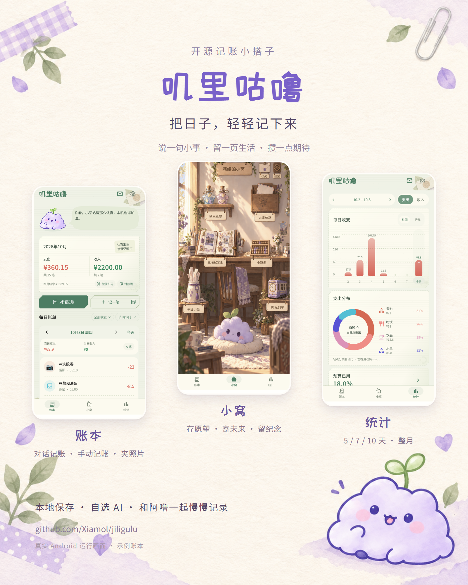
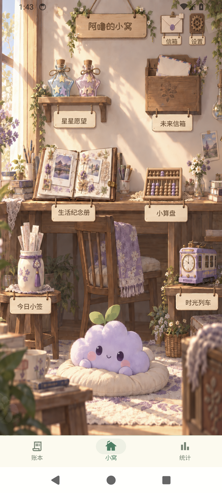
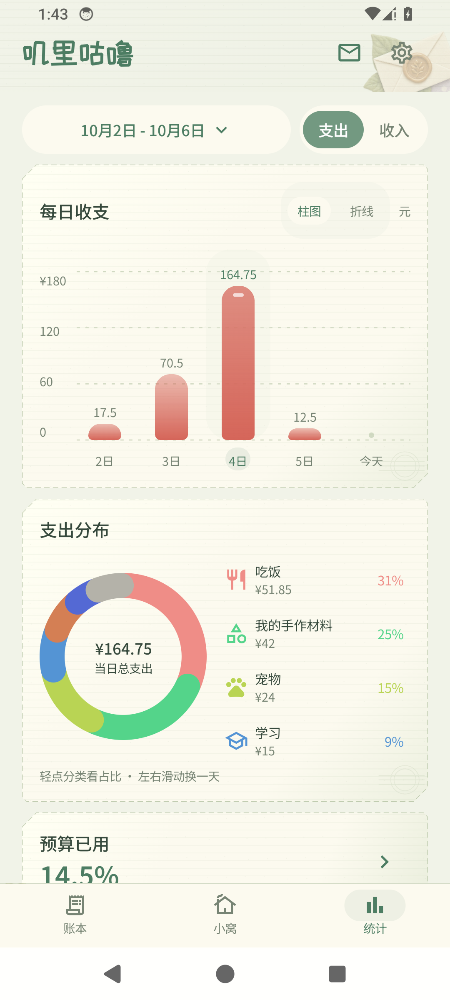

# 叽里咕噜 · 阿噜的小生活家 🪻

一只会陪你记账、收好回忆的糯云团。聊天记一笔，夹一张生活照片，再去阿噜的小窝坐坐。

**已发布：1.0.0 · 本地测试构建：1.0.12** · Android 8.0 及以上 · Kotlin / Jetpack Compose / Room

[下载 1.0.0](https://github.com/Xiamol/jiligulu/releases/tag/v1.0.0) · [本次更新](docs/RELEASE_1_0_0.md) · [公告信箱](docs/ANNOUNCEMENTS.md)

## 从小账本，长成小生活家

- **账本**：对话记账、图片识别和悬浮截图，先检查草稿，每笔可独立夹生活照片，再确认入账；手动记账支持自动分类、小算盘和夹照片。支付宝和微信的扫码、付款码入口并排放在账本页。
- **小窝**：整页插画场景里的愿望瓶、未来信箱、生活纪念册、今日小签与时光列车。点点房间里的物件，打开属于自己的小角落。
- **统计**：5 / 7 / 10 天与整月柱图，月边界先回弹、连续第二次滑动才跨月；顶部箭头按周期移动，点日期确认定位。整月折线展示实际支出和日均参考线；分类圆环、可滚动图例、小窗明细和预算进度。图中直接切换周期，预算下可切换月/年已过比例。主导航顺序为账本、统计、小窝。

星星形状的愿望瓶记录攒钱进度；未来信笺留给以后的自己；照片可以夹进账单、纪念册，也能制作明信片和海报。喜欢的小签与纸条可以收藏，还能写下自己的话，寄给阿噜后可在未来信箱收到 AI 回信。

四款皮肤关联页面装饰与配色。阿噜会说悄悄话，也有睡眠、夜景和一些藏起来的小彩蛋，等你慢慢发现 ♡

### 记账之外，坐下来玩一局

象棋、15 路五子棋、穿墙贪吃蛇和好运转盘，转盘还可玩小六壬。阿噜在好运页面换上长衫、布帽，拿着阴阳扇和卦签陪你玩。棋类支持人机、同屏轮流、附近棋友及互联网房间；选中、可落点、悔棋协商、回合计时、走子动画和结算反馈都更清楚。棋友名片可选择相册头像，新版棋友之间按有界协议互传，旧版保持默认头像。附近对局需要同一局域网，互联网房间需要网络和可用的房间服务。

## 看看阿噜的小窝

以下介绍图记录 1.0.6 的 Android 模拟器界面，使用演示数据。1.0.12 的 AI 花销明细只展示用途、花费和缓存命中率，旧记录以“历史汇总”保留原估算；好运页面使用专用小先生立绘。1.0.11 的整月总览和固定操作栏继续保留。此前改动见 [1.0.10 简答与改命实测](docs/LIUREN_ANSWER_FIRST_2026_10_09.md)、[1.0.9 房间输入修复](docs/LIUREN_ROOM_2026_10_09.md)、[1.0.8](docs/COMPANION_FOLLOWUP_2026_10_08.md)、[1.0.7](docs/MEMORY_INTERACTION_2026_10_08.md)；显示会随主题、屏幕与内容变化。



 

## 安装与使用

从 [GitHub Releases](https://github.com/Xiamol/jiligulu/releases/latest) 下载 APK。已有版本请**直接覆盖安装，不要先卸载**，保留本机账单、照片、对话与设置。1.0.0 使用 versionCode 13，沿用此前安装包签名。

基本账本、小窝和本地游戏可离线使用。AI 对话及识图支持 DeepSeek 和自定义 OpenAI Chat Completions 兼容供应商，地址、模型及密钥分别保存；需要联网，免鉴权的本地服务可不填 Key。公开安装包不内置开发者的私人 Key，费用以服务商账单为准。账单上下文可选择 3、7、30、90 天或全部时间范围；全部最多带入最近 1000 笔，明细还有字符预算，范围说明与费用提示可点击问号查看。精确检索始终使用完整账本。阿噜的小记忆独立保存在本机，支持明确自述和有上下文的简短回答，可关闭、更正或删除；旧对话可在本地预览补记，不将阿噜的猜测当成用户资料。AI 花销页按天和用途展示响应提供的 token 与当时配置单价算出的费用；未报告或未定价部分显示未知，不冒充服务商实扣，也不承诺固定命中率。

悬浮图标可调整大小并记住位置。局外保持透明材质，已移除全局持续采样；局内拖动和页面滚动时连续交接背景折射，静止时没有定时采样。设置可直达系统的悬浮常驻通知类别并单独隐藏，邮件、喝水提醒与主动截屏使用不同类别；系统的悬浮/前台服务提示仍由 Android 管理。只有主动截图或准备截屏时才申请系统共享授权，授权待机期间不处理屏幕画面。微信快捷入口需要安装微信，双开设备可能先显示系统应用选择页。

小六壬先听你想问的事，再选择当前农历月日时或三位灵感数字；默认显示直接结论、短原因和实际建议，三宫推演按需展开。恋爱、复合、普通朋友与出行分别理解，不合格回复用明确标注的本地简答，不自动购买修复；重看合格解读不重复请求。改命播放大吉章，并切换到当前课的鼓励版结论与行动，原解读可查看，回执会保留且不冒用到其它课。它与星座运势分别记录次数。心事回信先显示到达提示，点击去完整邮局，再手动打开收件箱。

待定分类可预览、勾选账单，确认后创建合适的新分类或复用已有分类；金额、时间与附件保留。草稿只突出账单内容，图片识别原文仍保存，重复技术说明不再占据主界面。

数据保存在本机。调用 AI 时会发送你提交的文字/图片、近期对话和必要的账本上下文；识别不会自动入账。当前没有跨设备同步或独立整库备份功能，请妥善保留本机数据。

## 构建

需要 Android SDK 35、JDK 17 或 21。配置本机 `local.properties` 的 `sdk.dir`，使用随项目提供的 Gradle Wrapper。

```powershell
.\gradlew.bat :app:assembleRelease :app:testDebugUnitTest --offline -PpublicRelease=true
```

`-PpublicRelease=true` 强制留空构建时默认 API Key。个人本地构建可在未提交的 `local.properties` 配置 `DEEPSEEK_API_KEY`，也可安装后在设置中填写。

APK：`app/build/outputs/apk/release/app-release.apk`；测试报告：`app/build/reports/tests/testDebugUnitTest/index.html`。

Room schema 为 v6，保留 v1–v6 迁移链，升级不清库。发布时增加 versionCode，保持 applicationId 和签名一致。[数据升级](docs/DATABASE_UPGRADES.md) · [更新源](docs/UPDATES.md)

## 源码与第三方资源

源码已公开在本仓库。界面、字体、美术及第三方组件的许可分别适用，不将代码公开等同于所有素材均可任意商用。

Pikafish 组件及对应源码、作者和许可证随包保留，见 [打包说明](third_party/pikafish/PACKAGING.txt)。配套权重有独立的[非商业用途许可](third_party/pikafish/NNUE-License.md)。字体许可在 `app/src/main/assets/licenses`。

阿噜会继续陪你慢慢记，把普通的一天也收好。
